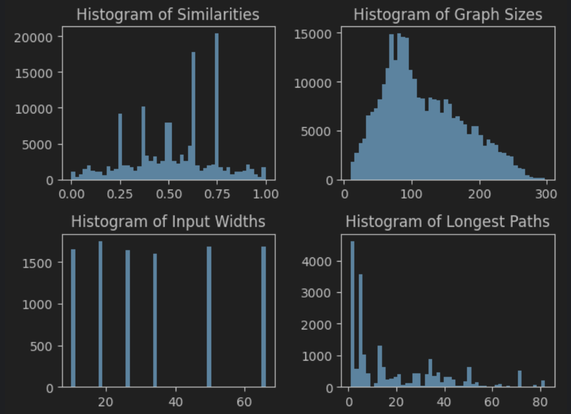
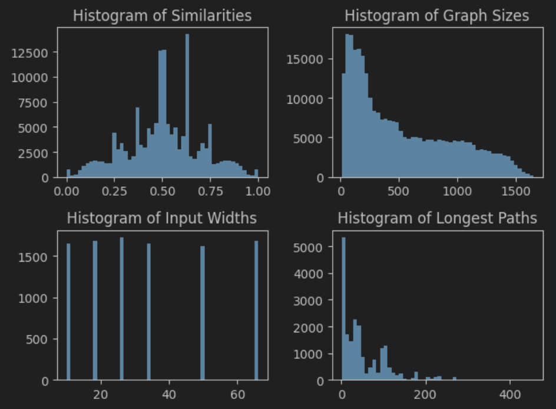

### Functional Embedding Network (FEN) ###

This repository was created as a part of project for the course BIN at FIT VUT.

This repository contains the code for the Functional Embedding Network (FEN) model, which is a neural network 
architecture for learning embeddings of digital circuits. The model assigns a vector to each gate in the circuit,
such that the vectors can be used to compare the gates in terms of their functionality. The model is trained so that
the cosine similarity between the vectors of two gates is high if the gates are functionally similar, and low if they
are not.

### Architecture ###

The FEN model is a feedforward graph neural network that takes as input a graph representation of a digital circuit
in AIG (And-Inverter Graph) format. The model starts by assigning unique vector to each input and then uses multi layer
perceptron to compute the embedding of each gate from the already computed embeddings of its fanins.

Similarity of two gates is computed as follows:

`similarity(gate1, gate2) = (cosine_similarity(emb(gate1), emb(gate2))) + 1 / 2`

which means that similarity is in the range [0, 1] where 0 means that the gates doesn't agree on any input and 1 means
that the gates agree on all inputs.

_Note: The similarity 0 means that output of gate1 is exact negation of output of gate2_

And the loss function is defined as:

`loss = (similarity(gate1, gate2) - ground_truth_similarity(gate1, gate2))^2`

where ground truth is obtained from simulation.

### Comparison with existing methods ###

DeepGate: https://arxiv.org/pdf/2111.14616

Compared to DeepGate, FEN brings the following advantages:

- While DeepGate trains two separate MLP (one for NOT gate and one for AND gate), FEN trains only a single MLP
for AND gate, embedding for NOT gate is computed simply as negation of its fanin embedding. This is possible because
there is only one possible embedding of NOT gate which will produce similarity 0 with its fanin. Thanks to this, much less
parameters are needed and the model is easier to train.
- FEN doesn't work with structural information. DeepGate uses besides functional information also structural information,
even though structural information doesn't play any role in the functional similarity. This structural information can
act as a bypass of loss function and can decrease generalization. FEN doesn't use any structural information and full
information is stored in the functional embeddings, which improves generalization.
- Embeddings of FEN are more interpretable. Embeddings of DeepGate are not directly interpretable as functional similarity
of two gates. While FEN uses loss described above, DeepGate uses loss as follows:
```
emb_dis = 1 - torch.cosine_similarity(node_a, node_b, eps=1e-8)
emb_dis_z = zero_normalization(emb_dis)
tt_dis_z = zero_normalization(ground_truth)
func_loss = self.reg_loss(emb_dis_z, tt_dis_z)
```
- While DeepGate can be used to compare gates only inside one circuit, FEN can be used to compare gates from different
circuits. This is because FEN learns also embeddings of input signals, in contrast to DeepGate which for each circuit
generates random orthogonal vectors for input signals.

### Performance ###

The performance of the model was compared with DeepGate.
All models were trained on the same dataset `ariths_gen_100_high_prec_augmented`. 
Inference time was measured on the RTX 3060 12GB GPU for size 100 circuits.
DeepGate had to be modified (loss function as described above, consistent embeddings for input signals) to be able to
compare it with FEN.

| Model | Mean absolute error | Inference time | Size | Epochs |
| --- |---------------------| --- |------|--------|
| FEN | 1.99%               | 0.1s | 5.9M | 40     |
| DeepGate | 4.65%               | 0.1s | 0.6M | 6      |
| FEN | 2.11%               | 0.1s | 1.4M | 24     |

**!!!!!!!!!!!!!!!!!!! Results for DeepGate will be updated after training is done :)**


#### Random dataset ####
FEN was designed primarily as a fast replacement for simulation in the context of cartesian genetic programming.
Genetic algorithm generates mutations of circuits randomly, therefore it's important that the model generalizes well to
circuits that were generated randomly (as opposed to circuits generated by human designers or deterministic algorithms).
To rule out the possibility that the model learns specific patterns, the model was tested on a randomly generated dataset.
More about the dataset used in the experiments can be found in the `Datasets` section.

| Model | Mean absolute error | Size |
| --- |---------------------|------|
| FEN | 6.65%               | 5.9M |
| FEN | 6.74%               | 1.4M |
| DeepGate | 9.51%               | 0.6M |


#### Bigger circuits ####
Models were tested on bigger circuits of size 500, without any additional training.

| Model | Mean absolute error | Size |
| --- |---------------------|------|
| FEN | 4.95%               | 5.9M |
| FEN | 5.20%               | 1.4M |
| DeepGate | 4.64%               | 0.6M |


### Datasets ###

#### Real dataset ####
Datasets were sampled from the set of circuits from https://github.com/ehw-fit/ariths-gen/tree/main/generated_circuits/cgp_circuits/flat.
Circuits from this set were transformed to AIG format and randomly paired.
Circuits were then simulated for N steps with random inputs. Random nodes were selected from both circuits in pairs
and similarities were compute as described above. 

Augmentation in form of randomly changing fanins of gates was applied to the dataset. 

Exact settings of this proces can be found in the `metadata.json` file in the dataset directory.

Circuit in the ariths-gen set were split into training and validation set. All *cska* circuits were used for validation
and the rest for training. Validation set didn't contain any circuits from the training set, and didn't used augmentation.

To get more insight into the dataset see `experiments/dataset_visualizer.ipynb`.
Note that the ground truth was obtained by simulation, so the dataset contains intrinsic noise,
and the model trained on this dataset can never achieve 0% error.
The estimated error can also be computed in the notebook.
For the training set, the estimated error is 0.4%. 

**Training dataset:** ariths_gen_100_high_prec_augmented\

**Bigger circuits dataset:** ariths_gen_500_high_prec_augmented


#### Random dataset ####
Fully random dataset would be generated by randomly selecting gates and randomly connecting them.
Dataset generated in this way would be highly unbalanced (most of the outputs would be constant 0 or 1).
To balance the dataset, refinement was applied. Refinement is a process where for each signal
in the circuit probability of being 1 is computed. From this probability, information is calculated. Then, for inputs to each gate,
signals with higher information are preferred. This way dataset is balanced and contains more
interesting circuits.

### Repository structure ###

Besides the model, the repository contains multiple tools for working with digital circuits:

- `dataset_generator/` - tools for creating datasets from set of digital circuits.
This tool samples circuits of random size from the set of circuits, applies random augmentation,
transforms the circuits to AIG format, perform simulation and saves the dataset.
- `utils/` - tools for working with CGP, AIG, graphs and simulation.

Repository also contains:
- `datasets/` - generated datasets
- `pretrained_models/` - pretrained models
- `experiments/` - scripts for training and evaluating the model and quality of dataset. 

